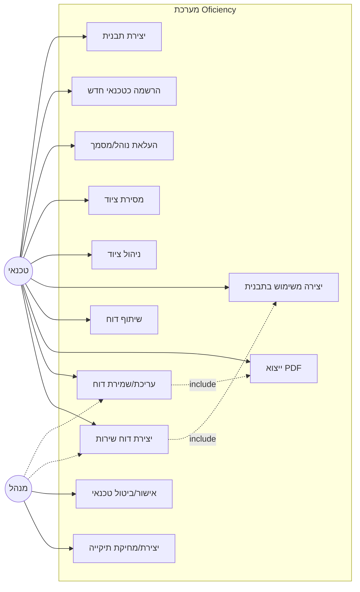
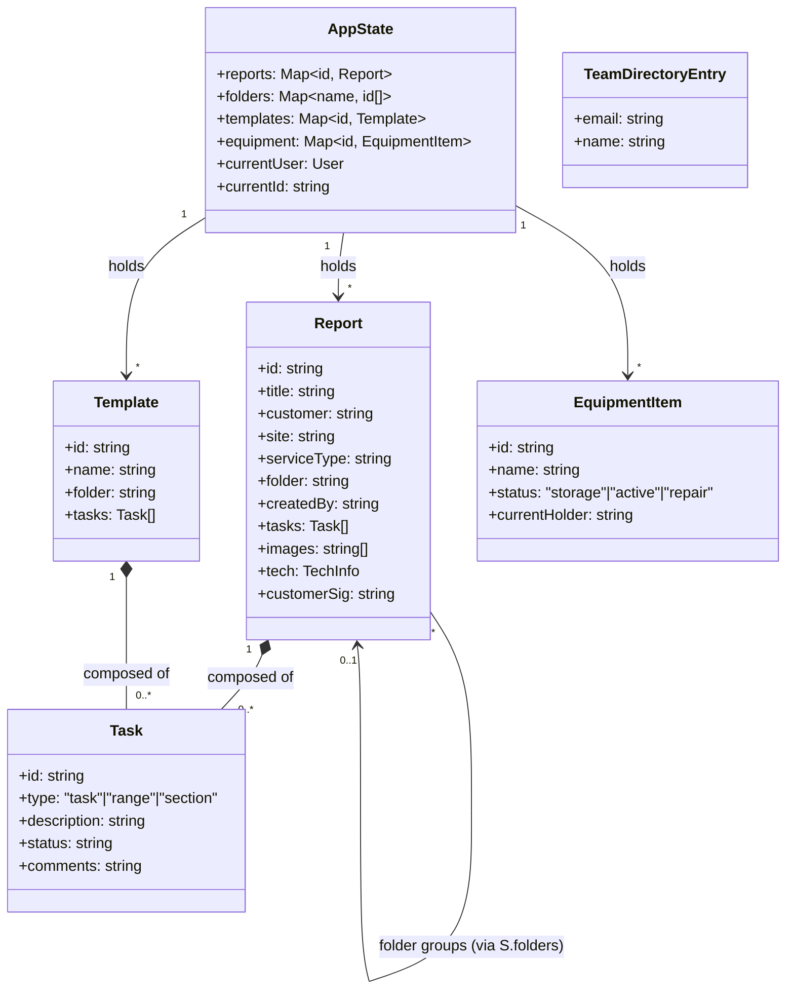
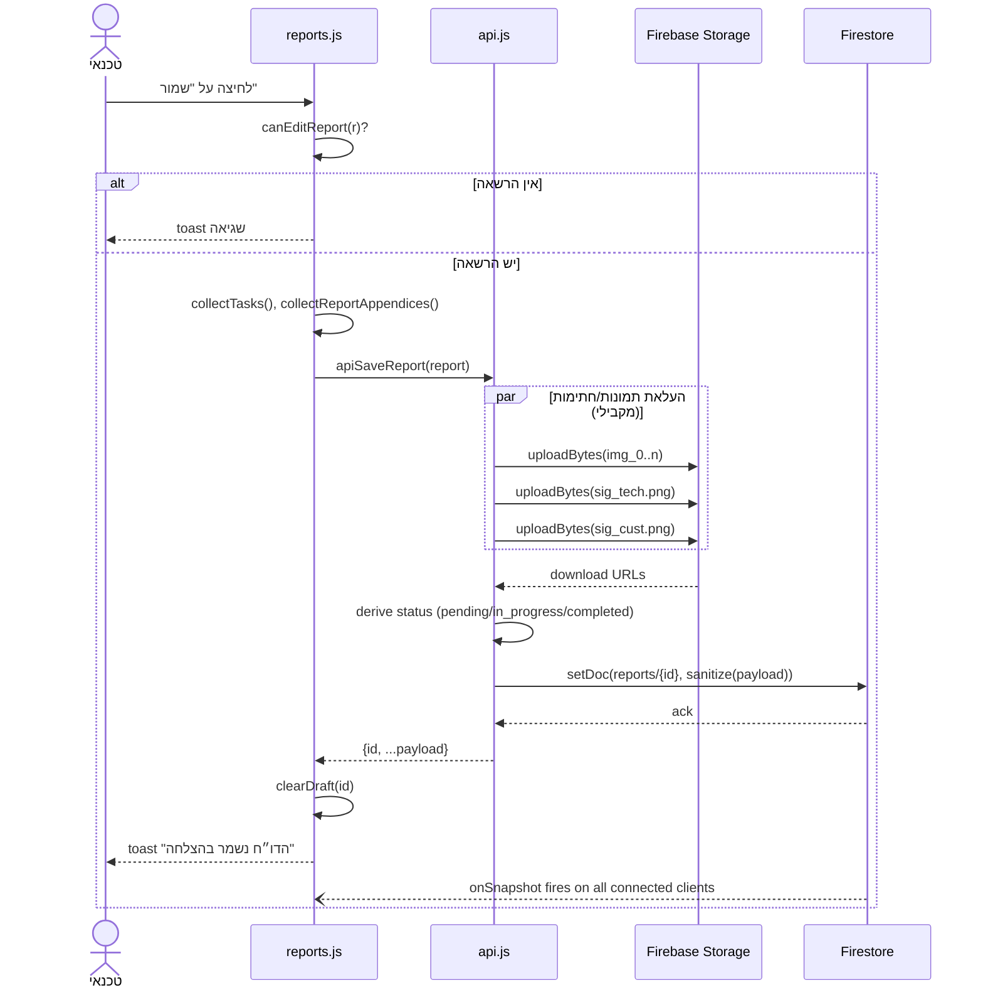
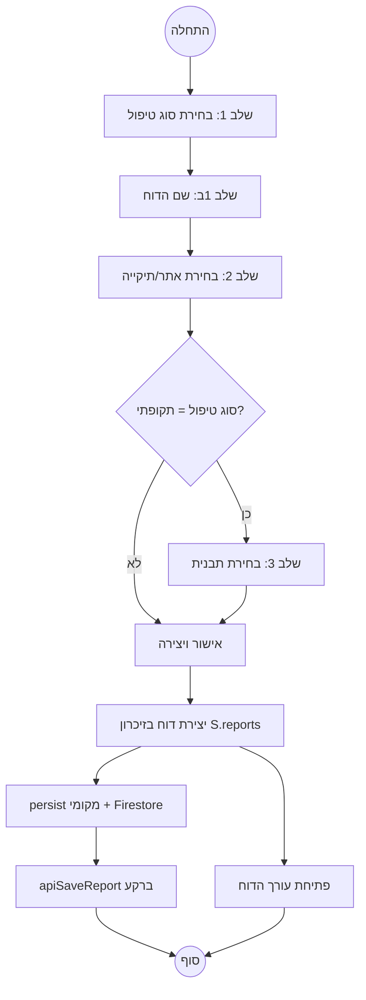

# דיאגרמות UML — Oficiency

מסמך זה מדגים את המערכת הקיימת דרך ארבע הדיאגרמות המרכזיות של UML, כל אחת עונה על שאלה אחרת. ראו [PRD.md](PRD.md) לדרישות ו-[SRS.md](SRS.md) לפירוט טכני מלא.

---

## 1. Use Case Diagram — מה המערכת עושה עבור המשתמשים

עונה על: "מה יכול כל סוג משתמש לעשות?"

**הערות:**
- `Admin` "יורש" את כל היכולות של `טכנאי` (הוא יכול לערוך כל דוח, לא רק את שלו) — ביוזם דיאגרמת Use Case מלאה זה מיוצג כ-generalization בין האקטורים, אך הושמט כאן לשם פשטות.
- UC11 (אישור/ביטול טכנאי) מוגבל אך ורק למנהל — אין נתיב חלופי.
- UC10 (ניהול תיקיות) מוגבל אך ורק למנהל.

---

## 2. Class Diagram — המבנה הסטטי (State Object)

עונה על: "איך המידע בזיכרון בנוי ומתייחס אחד לשני?" — זו לא דיאגרמת מחלקות OOP קלאסית (האפליקציה לא כתובה עם מחלקות), אלא ייצוג של אובייקט ה-state הגלובלי `S` וישויות הליבה שלו, כפי שהן מוגדרות ב-`Js/api.js`.

**הערה על Composition:** `Task` מיוצג כ-composition (יהלום מלא) בתוך `Report` ו-`Template` — משימה לא קיימת ללא הדוח/תבנית שמכיל אותה, ואין לה קיום עצמאי או מזהה שמשותף בין שני דוחות.

---

## 3. Sequence Diagram — שמירת דוח (התהליך הקריטי ביותר במערכת)

עונה על: "מה בדיוק קורה, ובאיזה סדר, כשטכנאי לוחץ 'שמור'?"

**הערה:** ה-`onSnapshot` בתחתית מדגים את הסנכרון החי בין מכשירים — כל לקוח מחובר אחר מקבל את השינוי כמעט מיידית, לא רק המכשיר ששמר.

---

## 4. Activity Diagram — אשף "דוח חדש"

עונה על: "מה זרימת ההחלטות ביצירת דוח חדש?"

---

## סיכום — איזו דיאגרמה מתי

| שאלה | דיאגרמה |
|---|---|
| מה כל משתמש יכול לעשות? | Use Case |
| איך הנתונים מאורגנים בזיכרון? | Class |
| מה סדר הפעולות בזרימה קריטית אחת? | Sequence |
| מה זרימת ההחלטות בתהליך מרובה-שלבים? | Activity |
